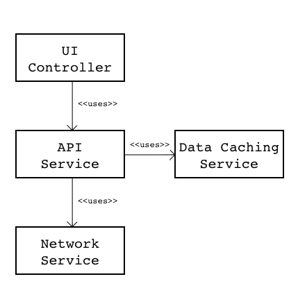

#Technical decisions
* cache forecast data on device to improve user experience and to reduce load on the data provider [see "Persistence/Data Caching" below](#Persistence)
* use simple model reflecting the API model. There's no need for custom application model. [see "Model" below](#Model)
* three main services constitue data providing services:
	* network service
	* api service
	* data caching service

##Main Services

### Network Service
Encapsulates low level details of network communication, network operations execution and operations queueing. 

### Data Caching Service
Encapsulates data caching described in details in [Data Caching](#DataCaching)

### API Services
Understands the remote API. Can fetch data by using the networking service.

##Data Caching
The persistence requirements are very simple:

 * persist the data received from the server,
 * persist the date/time when the response was received,
 * model is read only,
 * no queries or filtering,
 * the only aggregation is grouping the forecast data by day.
 * weather forecast data expire in not less than 10 minutes; requirement set by openweathermap.org

All the above will be fully satisfied by saving JSON data in the file system everytime a successful response is received from the server.

##Model
Since the application is very simple and built around the API, the application model is determined by the API. There are only two entities needed to satisfy the UI. 

##Location#
Represents a location with forecast data

| property        | type           | JSON mapping  | description  |
|-----------------|----------------|---------------|--------------|
|cityId|Int|city.id|City ID
|name|String|city.name|City name
|forecastByDay|[String:[Forecast]]| N/A |Forecast elements groupped by day|

##Forecast

| property        | type           | JSON mapping  | description  |
|-----------------|----------------|---------------|--------------|
|epoch|Int|list.dt|Time of data forecasted, unix, UTC
|dateTime|String|list.dt_txt|Data/time of calculation, UTC
|weatherTitle|String|list.weather.main|Group of weather parameters (Rain, Snow, Extreme etc.)
|weatherDescription|String|list.weather.description|Weather condition within the group
|temp|Float|list.main.temp|Temperature
|pressure|Float|list.main.pressure|Atmospheric pressure on the sea level by default, hPa
|humidity|Int|list.main.humidity|Humidity, %

##Future Model Changes
Future release of the app will support:

* multiple user defined locations including
 * locations selected from list, and
 * locations defined by geo coordinates (i.e. "my current location")
* ordering of the locations in the UI
* using custom names on locations (i.e. "My Home")
* more deatiled forecast information

##Location

| property        | type           | JSON mapping  | description  |
|-----------------|----------------|---------------|--------------|
|orderIndex|Int|N/A|Allows users to order multiple cities in the UI. Cities will be ordered by this property, ascending.
|latitude|Float|city.coord.lat|
|longitue|Float|city.coord.lon|
|customName|String|N/A|(optional) Custom name created by user (i.e. "Home")

##Forecast
| property        | type           | JSON mapping  | description  |
|-----------------|----------------|---------------|--------------|
|clouds|Int|list.clouds.all|Cloudiness, %
|windSpeed|Float|list.wind.speed|Wind speed. Unit Default: meter/sec, Metric: meter/sec, Imperial: miles/hour
|windDirection|Float|list.wind.deg|Wind direction, degrees (meteorological)
|rain|Float|list.rain.3h|Rain volume for last 3 hours, mm
|snow|Float|list.snow.3h|Snow volume for last 3 hours

