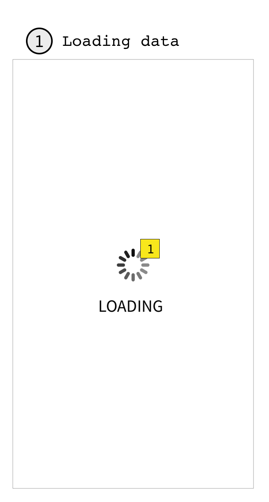

 

## Loading of data

Use cases:

3. Initial state when there’s no data cached
4. User triggered reload and cache expired
5. User re-opened the app and cache expired

Key elements:

1. Animated feedback; tells user the app is making progress
	

## Show valid data

Use cases:

1. Data successfuly loaded from API
2. Valid data successfuly loaded from cache


Key elements:

1. Title; name of the selected city
2. Reload button; enables user to reload data.
	* **NOTE:** Does not force data API call if cache data is still valid.
3. Row of daily data; See diagram [single row of data](#single_row)
	* **NOTE 1:** number of cells in row varies depending on data returned by API. Use horizontal  scroll if needed. 
	* **NOTE 2:** Does horizontal scroll need a visual clue? Test in UI mockup.

## Single row of data

Use cases:

1. Display row of daily weather forecast data

Key elements:

1. Row’s title
	* **NOTE:** Today data’s row is titled “TODAY”. Tomorrow data’s row is titled “TOMORROW”. Following days are title by the names of the days of the week ( “Monday”, “Tuesday” )
* Details of forecast data for specific hour as returned by API. Presented:
	* sample’s time in 24 hrs format
	* description ( as in API data )
	* temperature
	* humidity
	* pressure